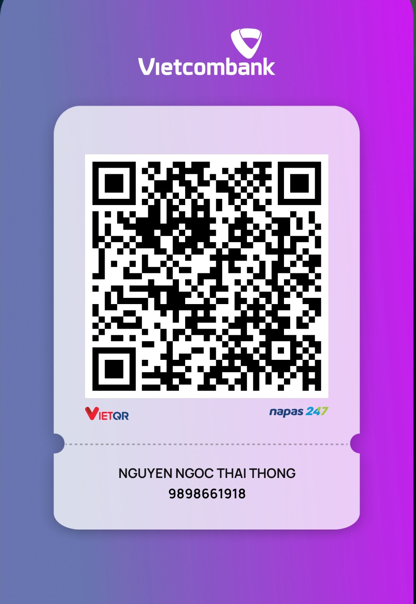

# 🧭 ĐẠI THUẬT LA KINH PHONG THỦY TỐI THƯỢNG

> **Hệ thống Nhất Thể Đa Tầng lọc khí trường qua 3 màng lọc toán pháp từ Vĩ mô đến Vi cục (Bát Trạch 45° ➔ 24 Sơn 15° ➔ 72 Hậu 5°).**

Ứng dụng PWA (Progressive Web App) hỗ trợ đo đạc, tính toán và thẩm thấu từng văn bản rung động vi mô của long mạch, tự động phân tích và tối ưu hóa phương vị toàn diện chuẩn sát theo dòng chảy năng lượng của **Huyền Không Đại Vận 9 (2024 - 2043)**.

---

## 🔮 TÍNH NĂNG CỐT LÕI

* **Lập số Bát Trạch theo Lập Xuân:** Tự động quy đổi ngày Dương lịch sang Năm Âm lịch (Can Chi) chuẩn thiên văn số học để xác định chính xác cung phi chủ mệnh.
* **Đảo chuyển Âm Dương (Tọa Hung Trấn Sát):** Thuật toán thông minh tự động nhận diện công năng hạ tầng. Đối với khu vực uế tạp (*WC, Bể phốt, Nhà kho*), hệ thống sẽ đảo ngược điểm số để tính toán cách cục "Dùng hung trấn hung — Lấy độc trị độc".
* **Bù trừ sai số từ trường:** Tự động tính toán và bù trừ độ lệch từ thiên giữa Bắc từ trường và Bắc địa lý thực tế.
* **Trải nghiệm PWA cao cấp:** Khả năng cài đặt trực tiếp về điện thoại như ứng dụng native, hoạt động ngoại tuyến mượt mà và tự động cập nhật ngầm định.

---

## 🧠 THUẬT TOÁN ĐIỂM TỔNG HỢP (PT)

Trái tim của hệ thống vận hành dựa trên phương trình tích hợp đa tầng, lọc sạch khí trường qua 3 lớp nghiêm ngặt nhằm tìm ra tọa độ đặt cát vị hoặc trấn hung tối ưu nhất:

$$PT = [ ( BT_{Gốc} + \Delta H_{72} ) \times K_{Van} - \Sigma\Psi_{Sat} ] \times \Gamma_{Khai}$$

### Chi tiết cấu trúc thuật toán:
* **$BT_{Gốc}$ (Điểm nền Đại & Trung cục):** Trích xuất dynamic từ bản đồ 192 cặp tương tác giữa Mệnh Cung Phi và 24 Sơn vị ($15^\circ$) trong ma trận Bát Trạch Minh Châu.
* **$\Delta H_{72}$ (Biên độ Mạch khí 72 Hậu):** Tầng vi cục quản lý biên độ khí trường chính xác đến từng bước nhảy $5^\circ$ (Ví dụ: Loại bỏ trục Không Vong, phân tách suy khí và vượng khí).
* **$K_{Van}$ (Trọng số Vận Tinh Huyền Không):** Đòn bẩy thời vận dịch chuyển dynamic bám sát Niên độ khảo sát, kích hoạt xung lực vượng khí tối đa cho đương vận **Vận 9**.
* **$\Sigma\Psi_{Sat}$ (Thần sát Lưu niên):** Khấu trừ năng lượng chướng khí từ Ngũ Hoàng Đại Sát (trừ 28đ) và Thái Tuế đáo hướng (trừ 18đ) hàng năm đối với các kết cấu nạp khí.
* **$\Gamma_{Khai}$ (Hệ số Thông Khí Khai Môn):** Tự động nhân hiệu ứng đòn bẩy phát triển $1.15$ khi các cấu trúc hạ tầng mở hướng (*Cửa chính, Cổng*) đặt đắc cách vào Sơn vị vượng khí.

---

## 🎯 GIẢI MÃ 4 VÒNG LA BÀN

| Tầng Lớp | Độ Rộng | Tên Gọi | Mô Tả Ý Nghĩa |
| :--- | :--- | :--- | :--- |
| **Vòng 1** | $45^\circ$ | **8 Hướng (Bát Trạch)** | Phân định đại thể các cung lớn (Khảm, Ly, Chấn, Đoài...) |
| **Vòng 2** | $15^\circ$ | **24 Sơn vị** | Định vị chi tiết phương vị đất (Tý, Quý, Sửu, Cấn...) |
| **Vòng 3** | — | **24 Thần Sát** | Cảnh báo cát hung mang tính sự kiện (Phúc Đức, Tấn Tài, Ôn Hoàng...) |
| **Vòng 4** | $5^\circ$ | **72 Hậu (Xuyên Sơn)** | Tầng vi mô cốt tủy lọc tia năng lượng sạch dưới lòng đất |

> ⚠️ **LƯU Ý ĐẶC BIỆT TỪ CHUYÊN GIA:**
> Bát Trạch giúp bạn chọn đúng cái **Phòng ngủ** (Vùng không gian đại thể), còn 24 Sơn và 72 Hậu mới là thứ giúp định vị chính xác **tọa độ đặt Gối nằm hoặc vị trí đặt tâm Kim La Bàn** nhằm tránh hiện tượng *"Tuyệt mệnh trong Sinh khí"*.

---

## 📝 3 BƯỚC KHỞI SỰ NHANH CHÓNG

1. **Khởi tạo:** Nhập họ tên, ngày sinh dương lịch và chọn chính xác mục đích thiết lập phương vị (*Giường ngủ, Bàn thờ hoặc Nhà vệ sinh*).
2. **Chọn Hướng Điểm Cao:** Cuộn xem danh sách gợi ý đã được thuật toán sắp xếp, chọn hướng có Điểm số ($pt$) cao nhất ở trên cùng.
3. **Chốt Tọa Độ:** Cầm thiết bị ra thực địa xoay người để kim la bàn khớp với độ số chỉ định. Dòng trạng thái hiển thị dấu chấm xanh 🟢 (**Đại Cát**) là hoàn thành mạch pháp.

---

## 🔮 ĐẠI LUẬN SỐ MỆNH TOÀN DIỆN

Để lập Trận Đồ Xoay Chuyển Vận Mệnh kết hợp 16 Đại Thuật (*Tử Bình, Kỳ Môn Độn Giáp, Lục Hào, Thần Số Học & Nhân Tướng*), quý gia chủ cần chuẩn bị hồ sơ đầu vào:

* **Thông tin bản mệnh:** Họ tên + Giờ, Ngày, Tháng, Năm sinh chính xác.
* **Thông tin gia đạo:** Ngày tháng năm sinh của các thành viên trực hệ.
* **Hình ảnh thực tế:** Ảnh chụp lòng bàn tay nét (không gồng), ảnh chân dung trực diện ánh sáng tự nhiên không qua chỉnh sửa.
* **Sự vụ trăn trở:** Nêu rõ vướng mắc lớn nhất hiện tại về sự nghiệp, tranh chấp hoặc gia đạo cần tìm điểm tháo gỡ.

---

## ⚙️ PHÁT TRIỂN HỆ THỐNG PWA
* **Kiến trúc:** Thuần `HTML5` / `CSS3` / `JavaScript` không phụ thuộc thư viện ngoài.
* **Service Worker:** Sử dụng chiến lược `Cache-First` tối ưu hiệu năng tải dữ liệu, tích hợp hệ thống tin nhắn trạng thái đồng bộ thời gian thực theo cấu trúc Google Chrome (`CHECKING_FOR_UPDATE`, `UPDATE_AVAILABLE`, `VERSION_UPDATED`).

---

### 📬 LIÊN HỆ & ỦNG HỘ DỰ ÁN

* **Bản quyền hệ thống:** Thái Thông
* **Hòm thư tiếp nhận hồ sơ:** [ThaiThongsj@gmail.com](mailto:ThaiThongsj@gmail.com)
* **Kênh đóng góp duy trì dự án:** `9898661918` • **Vietcombank** (NGUYEN NGOC THAI THONG)

